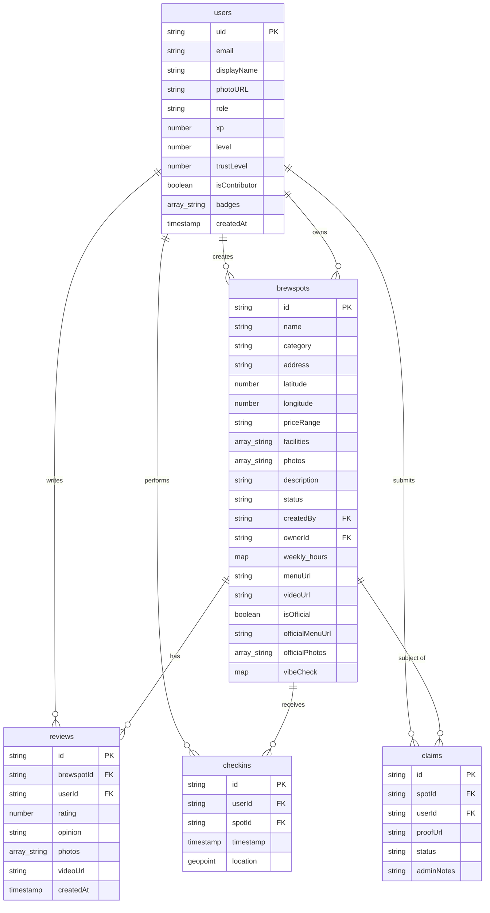

# Data Dictionary - Lokali 📍

This document outlines the Firestore collection structures and field definitions for the Lokali platform.

## 📊 Entity Relationship Diagram (ERD)

## 1. Collection: `users`
| Field | Type | Description |
| :--- | :--- | :--- |
| `uid` | string | Unique identifier from Firebase Auth. |
| `email` | string | User's email address. |
| `displayName` | string | Public name of the user. |
| `photoURL` | string | URL to profile image (Cloudinary). |
| `role` | string | `user`, `owner`, or `admin`. |
| `xp` | number | Total Experience Points earned. |
| `level` | number | Current level based on XP. |
| `trustLevel` | number | Internal score for automatic approvals. |
| `isContributor` | boolean | Privilege flag for high-quality contributors. |
| `badges` | array<string> | IDs of badges earned. |
| `createdAt` | timestamp | Account creation date. |

## 2. Collection: `brewspots` (formerly `spots`)
| Field | Type | Description |
| :--- | :--- | :--- |
| `id` | string | Auto-generated document ID. |
| `name` | string | Name of the location. |
| `category` | string | Primary category (e.g., `cafe`, `hidden_gem`). |
| `address` | string | Full textual address. |
| `latitude` | number | Coordinates for map rendering. |
| `longitude` | number | Coordinates for map rendering. |
| `priceRange` | string | `cheap`, `moderate`, `expensive`. |
| `facilities` | array<string> | Selected facilities (e.g., `Wifi`, `Toilet`). |
| `photos` | array<string> | User-contributed Cloudinary URLs. |
| `description` | string | User-provided description. |
| `status` | string | `pending`, `approved`, or `rejected`. |
| `createdBy` | string | UID of the user who submitted the spot. |
| `ownerId` | string | UID of the verified Business Owner (if claimed). |
| `weekly_hours` | map | `{ monday: { isOpen, openTime, closeTime }, ... }`. |
| `menuUrl` | string | Link to menu image or PDF. |
| `videoUrl` | string | Social media video embed link. |
| `isOfficial` | boolean | Flag for verified official spots. |
| `officialMenuUrl` | string | Verified menu URL managed by Owner. |
| `officialPhotos` | array<string> | Verified gallery managed by Owner. |
| `vibeCheck` | map | `{ summary: string, pros: [], cons: [], updatedAt: timestamp }`. |

## 3. Collection: `reviews`
| Field | Type | Description |
| :--- | :--- | :--- |
| `id` | string | Auto-generated document ID. |
| `brewspotId` | string | Reference to the `brewspots` document. |
| `userId` | string | Reference to the `users` document. |
| `rating` | number | Star rating (1-5). |
| `opinion` | string | Review text content. |
| `photos` | array<string> | List of Cloudinary URLs. |
| `videoUrl` | string | Optional video link. |
| `createdAt` | timestamp | Date of posting. |

## 4. Collection: `checkins`
| Field | Type | Description |
| :--- | :--- | :--- |
| `id` | string | Auto-generated document ID. |
| `userId` | string | Reference to the `users` document. |
| `spotId` | string | Reference to the `brewspots` document. |
| `timestamp` | timestamp | Time of check-in. |
| `location` | geopoint | Coordinates at the time of check-in (for validation). |

## 5. Collection: `claims`
| Field | Type | Description |
| :--- | :--- | :--- |
| `id` | string | Auto-generated document ID. |
| `spotId` | string | Reference to the `brewspots` document. |
| `userId` | string | UID of the user claiming the spot. |
| `proofUrl` | string | URL to legal documents/proof. |
| `status` | string | `pending`, `approved`, or `rejected`. |
| `adminNotes` | string | Admin notes or rejection reason. |
