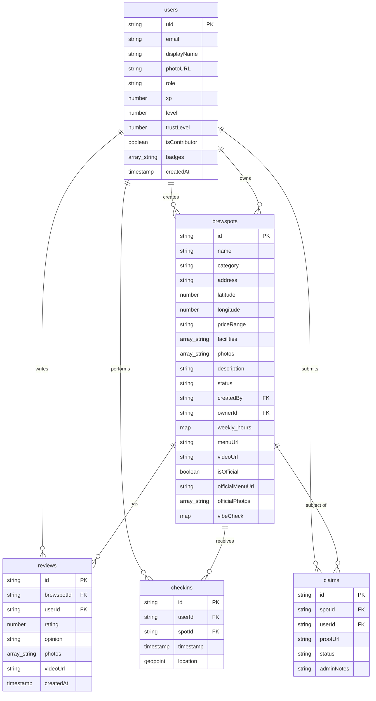
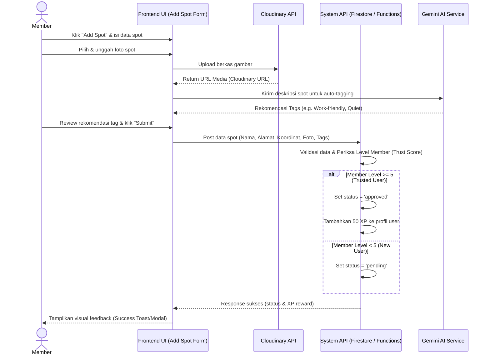
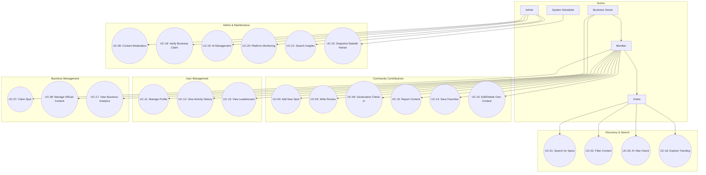

# 📜 Project Documentation Master - Lokali 📍

Dokumen ini adalah gabungan komprehensif dari seluruh perencanaan strategis, analisis bisnis, persyaratan teknis, dan desain arsitektur untuk proyek **Lokali**.

---

## 📑 Daftar Isi
1. [Product Strategy & Discovery](#1-product-strategy--discovery)
2. [User Stories](#2-user-stories)
3. [Use Cases Summary](#3-use-cases-summary)
4. [Use Case Scenarios (Detailed)](#4-use-case-scenarios-detailed)
5. [Functional Requirements](#5-functional-requirements)
6. [Non-Functional Requirements](#6-non-functional-requirements)
7. [Business Rules](#7-business-rules)
8. [Acceptance Criteria](#8-acceptance-criteria)
9. [System Architecture & Design](#9-system-architecture--design)
10. [Data Dictionary](#10-data-dictionary)
11. [Test Plan & Strategy](#11-test-plan--strategy)
12. [Risk & Constraints](#12-risk--constraints)
13. [Requirement Traceability Matrix](#13-requirement-traceability-matrix)
14. [UML & Draw.io Diagrams](#14-uml-diagrams)

---

## 1. Product Strategy & Discovery
*BA Perspective: Validating the "Why" and "What"*

### 1.1. Problem Statement & Hypothesis
**The Problem**
Pengguna kesulitan menemukan tempat nongkrong atau bekerja (cafe/spot) yang memiliki suasana spesifik (misal: tenang, wifi kencang, banyak colokan) hanya melalui Google Maps karena ulasannya terlalu umum dan tidak terorganisir.

**The Hypothesis**
Jika kita menyediakan platform dengan fitur "AI Vibe Check" (ringkasan suasana otomatis) dan sistem "Verified Check-in", maka pengguna akan mendapatkan informasi yang lebih akurat dan terpercaya, sehingga meningkatkan kepuasan pencarian lokasi.

### 1.2. Competitor Analysis (Benchmarking)
| Feature | Google Maps | PergiKuliner | **Lokali (Target)** |
| :--- | :--- | :--- | :--- |
| **Pencarian Lokasi** | Sangat Baik | Baik | Baik |
| **Review Pengguna** | Sangat Banyak | Menengah | Terverifikasi (XP) |
| **Ringkasan AI** | Terbatas/General | Tidak Ada | Spesifik (Vibe Check) |
| **Gamifikasi** | Level Local Guide | Tidak Ada | XP, Badges, Leaderboard |
| **Verified Check-in** | Tidak Ada | Tidak Ada | Ya (GPS Based) |

### 1.3. Lean Canvas (Visual Grid)

Berikut adalah visualisasi Lean Canvas untuk proyek **Lokali** yang mencakup aspek bisnis, solusi, dan target pasar:

| **1. PROBLEM (Masalah)** | **4. SOLUTION (Solusi)** | **3. UNIQUE SELLING PROP (USP)** | **5. UNFAIR ADVANTAGE** | **2. CUSTOMER SEGMENTS** |
| :--- | :--- | :--- | :--- | :--- |
| • Pengguna kesulitan mencari tempat (cafe, co-working space, spot viral) yang kondusif (tenang, WiFi stabil) atau menarik. • Banyak ulasan tempat yang bias/palsu di platform umum. • Pengguna malas membaca puluhan ulasan panjang untuk sekadar tahu suasana/vibe tempat tersebut. | • Peta interaktif pencarian spot lokal berbasis komunitas. • Verifikasi ulasan dengan **GPS-based check-in**. • Fitur rangkuman instan **AI Vibe Check** ulasan spot. | **"Find your perfect vibe, verified by the community and summarized by AI."**  *Menjanjikan pencarian suasana spot lokal yang riil, akurat, dan instan.* | • Algoritma ekstraksi sentimen ulasan terintegrasi Gemini AI. • Validasi lokasi fisik terintegrasi GPS untuk mencegah spam ulasan. | • **Digital Nomads / Remote Workers** yang butuh tempat kerja. • **Mahasiswa / Pelajar** yang butuh tempat belajar. • **Local Spot & Culinary Seekers** yang suka mencoba tempat viral & hidden gems baru. |
| **8. KEY METRICS (Metrik Utama)** | **9. CHANNELS (Saluran)** | **7. COST STRUCTURE (Struktur Biaya)** | **6. REVENUE STREAMS (Pendapatan)** | |
| • Jumlah Spot aktif terdaftar. • Tingkat keaktifan Check-in harian. • Volume ulasan baru dan rangkuman AI yang dihasilkan. | • Kemitraan spot & bisnis lokal (*Local Business Partnerships*). • Media Sosial (Instagram Reels, TikTok). • Rekomendasi komunitas (*Word of Mouth*). | • Biaya API (Google Maps SDK & Gemini API). • Hosting (Firebase Storage/Cloudinary & Vercel). • Pemeliharaan sistem. | • **Proyek Belajar (Non-Profit)**. • *Rencana Monetisasi Masa Depan*:   - Promosi kedai (*Featured Listings*).   - Dashboard Analitik berbayar untuk Owner. | *(Model Grid Bisnis)* |

### 1.4. User Personas
**Persona A: "Andi, The Digital Nomad"**
*   **Bio**: Freelancer programmer yang bekerja berpindah-pindah tempat (cafe, co-working space, perpustakaan, dll.).
*   **Pain Points**: Sering datang ke spot yang ternyata bising atau koneksi internet/stopkontak tidak memadai.
*   **Goals**: Menemukan spot tenang, kondusif, dan nyaman untuk bekerja dengan cepat.

**Persona B: "Siska, The Social Butterfly"**
*   **Bio**: Mahasiswi yang hobi mencoba tempat-tempat baru yang sedang viral (aesthetic spots, culinary pop-ups, hidden gems).
*   **Pain Points**: Kecewa jika tempat yang sedang tren di media sosial tidak sepadan dengan ekspektasi atau ulasannya bias.
*   **Goals**: Melihat foto autentik dan review jujur dari komunitas sebelum mengunjungi spot viral/aesthetic.

### 1.5. MVP Feature Prioritization (MoSCoW)
*   **Must Have**: Map Discovery, Add Spot, Write Review, AI Vibe Check.
*   **Should Have**: Verified Check-in (GPS), Leaderboard.
*   **Could Have**: Badge Achievements, Business Owner Dashboard.
*   **Won't Have (Now)**: In-app Booking, Food Delivery Integration.

---

## 2. User Stories
This document lists the user stories for the Lokali platform, structured by persona.

### 🚶 Visitor (Casual User)
- **US-01**: As a visitor, I want to search for spots (cafes, viral locations, hidden gems) on a map so that I can find a place to visit or work nearby.
- **US-02**: As a visitor, I want to filter spots by "Hidden Gem" tag so that I can discover unique places that aren't mainstream.
- **US-03**: As a visitor, I want to see an AI summary of reviews so that I can quickly decide if a place is worth visiting without reading 50 comments.
- **US-04**: As a visitor, I want to see photos of a spot so that I can judge the atmosphere before I go.

### 👤 Member (Contributor)
- **US-05**: As a member, I want to add a new spot I found so that I can share it with the community and earn XP.
- **US-06**: As a member, I want to write a review with photos so that I can express my opinion and help others.
- **US-07**: As a member, I want to check-in at a location so that I can prove I was there and climb the leaderboard.
- **US-08**: As a member, I want to save a spot to my favorites so that I can easily find it again later.
- **US-09**: As a member, I want to see my contribution stats on my profile so that I can feel a sense of achievement.
- **US-10**: As a member, I want to report a fake spot so that the map stays accurate and clean.

### 💼 Business Owner
- **US-11**: As a business owner, I want to claim my spot so that I can manage my official information.
- **US-12**: As a business owner, I want to manage my official menu, business hours, and facilities so that customers get accurate data.
- **US-13**: As a business owner, I want to see how many people have viewed my spot so that I can understand my reach.
- **US-14**: As a business owner, I want to respond to reviews (Planned) so that I can engage with my customers.

### 🛡️ Admin
- **US-15**: As an admin, I want to review pending spots so that I can prevent spam or low-quality data from going public.
- **US-16**: As an admin, I want to verify business claim documents so that I can ensure only the real owners get control.
- **US-17**: As an admin, I want to see search trends so that I know which areas or categories need more data.
- **US-18**: As an admin, I want to ban abusive users so that the community remains safe and friendly.
- **US-19**: As an admin, I want to force an AI re-sync so that I can fix outdated or incorrect AI summaries.

---

## 3. Use Cases Summary
This document provides a summary of the primary use cases for the Lokali platform.

### 👥 Actors
- **Visitor**: Unregistered user browsing for information.
- **Member (User)**: Registered user contributing content and earning XP.
- **Business Owner (Owner)**: Verified owner managing their business profile.
- **Admin**: System administrator and moderator.

### 🛠️ Use Case Catalog
| UC-ID | Title | Actor | Description |
| :--- | :--- | :--- | :--- |
| UC-01 | Search for Spots | Visitor, Member | Find locations by name or category on the map. |
| UC-02 | Filter Content | Visitor, Member | Narrow down spots by specific tags or categories. |
| UC-03 | AI Vibe Check | Visitor, Member | View an AI-generated summary of reviews for a spot. |
| UC-04 | Add New Spot | Member | Submit a new location with details and photos. |
| UC-05 | Write Review | Member | Provide a rating, text review, and media for a spot. |
| UC-06 | Geolocation Check-in | Member | Validate presence at a location to earn XP. |
| UC-07 | Claim Spot | Member | Apply for official ownership of a business profile. |
| UC-08 | Manage Official Content| Business Owner | Update menus, hours, and official photos. |
| UC-09 | Content Moderation | Admin | Approve or reject pending contributions. |
| UC-10 | Report Content | Member, Admin | Flag inappropriate content for moderation. |
| UC-11 | Manage Profile | Member | Update personal info and view contribution stats. |
| UC-12 | View Activity History | Member | Track the status of submitted spots and reviews. |
| UC-13 | View Leaderboard | Member | See global rankings based on XP. |
| UC-14 | Save Favorites | Member | Bookmark spots for future reference. |
| UC-15 | Edit/Delete Own Content | Member | Manage personal contributions (reviews/spots). |
| UC-16 | Explore Trending | Visitor, Member | Discover popular spots based on community check-ins. |
| UC-17 | View Business Analytics| Business Owner | Monitor spot views and check-in trends. |
| UC-18 | Verify Business Claim | Admin | Review legal documents and grant Owner status. |
| UC-19 | AI Management | Admin | Manually trigger AI summary re-generation. |
| UC-20 | Platform Monitoring | Admin | View growth analytics and system health. |
| UC-21 | Search Insights | Admin | Analyze search trends to identify data gaps. |
| UC-22 | Data Aggregation | System | Automatically generate daily statistical snapshots. |

---

## 4. Use Case Scenarios (Detailed)
Dokumen ini menyajikan seluruh skenario penggunaan platform **Lokali** secara mendalam.

### UC-01: Pencarian Lokasi dengan MapCn
- **Aktor**: Visitor, Member
- **Alur Utama**:
  1. Pengguna mengetikkan nama lokasi.
  2. Sistem memberikan saran autocomplete.
  3. Pengguna memilih hasil.
  4. Peta transisi ke koordinat lokasi.
- **Post-condition**: Lokasi tujuan tertampil jelas di peta.

### UC-03: AI Vibe Check (Ringkasan Review)
- **Aktor**: Visitor, Member
- **Pre-condition**: Spot memiliki minimal 3 review.
- **Alur Utama**:
  1. Pengguna membuka detail spot.
  2. Sistem menampilkan ringkasan otomatis (Pros, Cons, Verdict).

### UC-06: Check-in Geolocation
- **Aktor**: Member
- **Alur Utama**:
  1. Member menekan "Check-in".
  2. Sistem mengambil GPS real-time.
  3. Sistem memvalidasi jarak (< 100m).
  4. Jika valid, XP ditambahkan.

*(Catatan: Detail lengkap untuk UC-01 s/d UC-22 tersedia di dokumentasi teknis).*

---

## 5. Functional Requirements
This document outlines the functional requirements for the Lokali platform.

### 5.1. Core Platform (Search & Discovery)
| ID | Requirement | Description | Priority |
| :--- | :--- | :--- | :--- |
| FR-01 | Interactive Map | System must display an interactive map using Mapbox/OpenStreetMap. | High |
| FR-02 | Location Search | Users must be able to search for locations by name, category, or city. | High |
| FR-06 | Spot Details | System must display full details of a spot, including photos, description, and operating hours. | High |

### 5.2. User & Community (Social)
| ID | Requirement | Description | Priority |
| :--- | :--- | :--- | :--- |
| FR-07 | User Authentication | Users must be able to register, login, and manage their passwords. | High |
| FR-08 | Add New Spot | Registered members must be able to submit new locations. (Menu/Hours restricted). | High |
| FR-09 | Review & Rating | Members must be able to write reviews, give star ratings, and upload photos/videos. | High |

### 5.3. Gamification & Engagement
| ID | Requirement | Description | Priority |
| :--- | :--- | :--- | :--- |
| FR-13 | Geolocation Check-in | Members can check-in if their GPS coordinates are within 100m of the spot. | Medium |
| FR-14 | XP System | Members earn Experience Points (XP) for every contribution. | Medium |

### 5.4. Business Management
| ID | Requirement | Description | Priority |
| :--- | :--- | :--- | :--- |
| FR-19 | Claim Business | Users can apply to claim ownership of an existing spot with proof of legality. | High |
| FR-20 | Official Content | Verified owners can manage official menus, business hours, and professional photos. | High |

---

## 6. Non-Functional Requirements
This document outlines the quality attributes and constraints for the Lokali platform.

### 6.1. Performance
- **NFR-01**: Page load under 3s on 4G.
- **NFR-02**: Search response within 500ms.

### 6.2. Security & Privacy
- **NFR-08**: Auth required for sensitive actions (JWT).
- **NFR-11**: Bot protection using Cloudflare Turnstile.

### 6.3. Usability
- **NFR-12**: Responsive design (Mobile, Tablet, Desktop).

---

## 7. Business Rules
This document defines the core logic and constraints.

### 7.1. Gamification & XP
- **Add Spot**: 50 XP.
- **Write Review**: 10 XP.
- **Check-in**: 20 XP (1 per day per spot).

### 7.2. Geolocation
- **Radius**: 100 meters.
- **Verification**: GPS data must be fresh (< 1 min).
- **Cooldown**: 18 hours per spot.

### 7.3. Permissions
- **Official Data**: Menu URL and Opening Hours can only be managed by `owner` or `admin`.

---

## 8. Acceptance Criteria
Conditions for feature completion.

- **Search**: Results within 500ms + Map animation.
- **Check-in**: GPS permission required + Distance < 100m.
- **Official Management**: Restricted inputs on Add/Edit form + Business Dashboard controls.

---

## 9. System Architecture & Design
*SA Perspective: Designing the "How"*

### 9.1. Tech Stack
- **Frontend**: Next.js 15 (App Router), Tailwind CSS, Shadcn UI.
- **Backend**: Firebase (Firestore, Auth).
- **AI Engine**: Gemini Pro API.
- **Media**: Cloudinary.

### 9.2. Core Module Architecture
- `src/features/auth`, `src/features/brewspot`, `src/features/reviews`, `src/features/gamification`, `src/features/ai`.

---

## 10. Data Dictionary
Firestore collection structures.

### 10.1. Collection: `users`
`uid`, `email`, `displayName`, `photoURL`, `role` (user/owner/admin), `xp`, `level`, `badges`, `createdAt`.

### 10.2. Collection: `brewspots`
`id`, `name`, `category`, `address`, `latitude`, `longitude`, `photos`, `status`, `ownerId`, `weekly_hours`, `menuUrl`, `officialMenuUrl`, `officialPhotos`.

---

## 11. Test Plan & Strategy
*QA/SA Perspective: Ensuring Quality*

- **Unit Testing**: Logic XP, Trending Score.
- **Integration**: Auth Flow, Add Spot -> Approval.
- **Geolocation**: Manual device testing.
- **Bug Severity**: S1 (Blocker) to S4 (Minor).

---

## 12. Risk & Constraints
- **External Dependencies**: Firebase, Gemini, Mapbox, Cloudinary.
- **Technical Constraints**: Client-side heavy (Mapbox), GPS accuracy in urban areas.
- **Compliance**: User Privacy (GPS data usage).

---

## 13. Requirement Traceability Matrix
Mapping User Stories to Requirements and Code.

| User Story | Functional Req | Use Case | Implementation Folder |
| :--- | :--- | :--- | :--- |
| **US-01** (Search) | FR-02 | UC-01 | `src/features/brewspot/api.ts` |
| **US-03** (AI Summary) | FR-17 | UC-03 | `src/features/ai/reviewSummarizer.ts` |
| **US-07** (Check-in) | FR-13 | UC-06 | `src/features/checkin/service.ts` |
| **US-11** (Claim Spot) | FR-19 | UC-07 | `src/features/admin/api.ts` |
| **US-12** (Manage Info) | FR-20 | UC-08 | `src/app/(protected)/dashboard/business` |

---

## 14. UML Diagrams
*Visualizing the System Architecture and Logic*

### 14.1. Entity Relationship Diagram (ERD)

### 14.2. Sequence Diagram: Add New Spot

### 14.3. Use Case Diagram

### 14.4. Draw.io Multipage XML Diagrams (.drawio)
Untuk dokumentasi yang lebih interaktif dan dapat di-edit langsung di aplikasi [Draw.io](https://app.diagrams.net/), file XML diagram multipage telah disediakan pada path berikut:
- **File**: [use_cases_and_activities.drawio](file:///c:/Users/User/Documents/Daffa/React/BrewSpot/docs/diagrams/use_cases_and_activities.drawio)

Halaman (Tabs) yang tersedia di dalam file `.drawio` tersebut:
1. **Halaman 1**: Use Case Diagram Level 0 (System Context)
2. **Halaman 2**: Use Case Diagram Level 1 (Visitor & Member Module)
3. **Halaman 3**: Use Case Diagram Level 1 (Business Owner, Admin, & System Module)
4. **Halaman 4**: Activity Diagram - Check-in Geolocation (UC-06)
5. **Halaman 5**: Activity Diagram - AI Vibe Check Auto-Summarizer (UC-03 / UC-19)
6. **Halaman 6**: Activity Diagram - Claim Verification (UC-07 / UC-18)

*Cara membuka di Draw.io*:
1. Buka [app.diagrams.net](https://app.diagrams.net/) di browser Anda.
2. Klik menu **File** -> **Open From** -> **Device**, lalu pilih file [use_cases_and_activities.drawio](file:///c:/Users/User/Documents/Daffa/React/BrewSpot/docs/diagrams/use_cases_and_activities.drawio).
3. Atau cukup seret (drag and drop) file tersebut langsung ke dalam area gambar Draw.io.
4. Anda dapat menavigasi tab halaman di bagian kiri/bawah jendela Draw.io untuk berpindah diagram.
