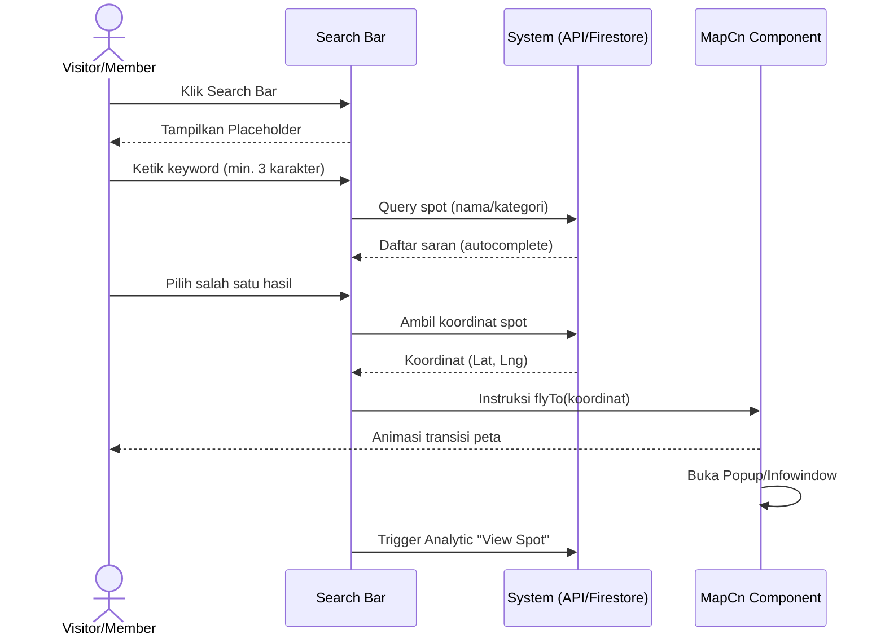

# 📄 Spesifikasi Detail Use Case: UC-01

## Pencarian Lokasi dengan MapCn

| Item              | Deskripsi                                                                                                      |
| :---------------- | :------------------------------------------------------------------------------------------------------------- |
| **ID**            | UC-01                                                                                                          |
| **Nama Use Case** | Pencarian Lokasi dengan MapCn                                                                                  |
| **Aktor Utama**   | Visitor, Member                                                                                                |
| **Deskripsi**     | Aktor mencari lokasi fisik (spot) menggunakan kata kunci nama atau kategori melalui antarmuka peta interaktif. |
| **Prioritas**     | High (Must Have)                                                                                               |

---

### 1. Kondisi (Conditions)

- **Pre-conditions**:
  - Pengguna berada di halaman Eksplorasi (`/explore`).
  - Koneksi internet aktif untuk memuat tiles peta (Mapbox/OpenStreetMap).
  - Database Firestore memiliki data spot yang valid.
- **Post-conditions**:
  - Peta berfokus pada lokasi yang dipilih.
  - Informasi ringkas lokasi (Card Preview) ditampilkan kepada pengguna.

---

### 2. Alur Kerja Utama (Main Success Scenario)

1. **Aktor** menempatkan kursor pada komponen Search Bar di atas peta.
2. **Sistem** menampilkan placeholder "Cari kafe, tempat hits, atau lokasi..."
3. **Aktor** mengetikkan minimal 3 karakter (misal: "Kopi").
4. **Sistem** melakukan query ke database/indeks pencarian dan menampilkan daftar saran (autocomplete).
5. **Aktor** memilih salah satu hasil dari daftar saran.
6. **Sistem** mengambil koordinat (latitude, longitude) dari dokumen spot tersebut.
7. **Sistem** menginstruksikan komponen MapCn untuk melakukan transisi `flyTo` ke koordinat tujuan.
8. **Sistem** membuka _Popup_ atau _Infowindow_ pada marker lokasi tersebut.
9. **Sistem** memicu event "View Spot" untuk keperluan analitik (UC-17).

---

### 2.1. Diagram Urutan (Sequence Diagram)

---

### 3. Alur Alternatif (Alternative Flows)

- **A1: Pencarian Berdasarkan Kategori**
  1. Pengguna mengetikkan kategori (misal: "Hidden Gem").
  2. Sistem menampilkan daftar spot yang memiliki tag/kategori tersebut.
  3. Pengguna menekan tombol "Show all results on map".
  4. Sistem melakukan _fitting bounds_ peta untuk mencakup seluruh marker hasil pencarian.

---

### 4. Alur Eksepsi (Exception Flows)

- **E1: Lokasi Tidak Ditemukan**
  1. Sistem tidak menemukan kecocokan data dengan kata kunci yang dimasukkan.
  2. Sistem menampilkan pesan "Maaf, lokasi tidak ditemukan. Coba kata kunci lain atau tambahkan spot baru?".
  3. Sistem memberikan saran tautan ke UC-04 (Add New Spot).
- **E2: Kegagalan API Peta**
  1. Map engine gagal dimuat atau limit API tercapai.
  2. Sistem menampilkan mode "List View" sebagai fallback otomatis.

---

### 5. Aturan Bisnis (Business Rules) Terkait

- **BR-01**: Hasil pencarian harus mengutamakan spot yang sudah `Verified` (Milik Business Owner).
- **BR-02**: Urutan autocomplete didasarkan pada jarak terdekat jika izin lokasi (GPS) diberikan.

---

### 6. Catatan UI/UX

- Menggunakan animasi transisi yang halus (duration: 1.5s) saat perpindahan kamera peta.
- Marker yang terpilih harus memiliki visual yang berbeda (misal: animasi _pulse_ atau warna yang lebih terang).
